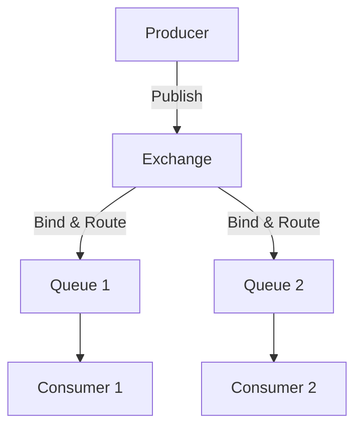
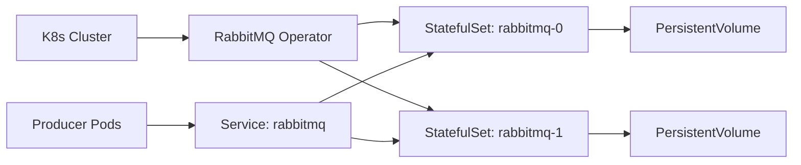

## Overview

RabbitMQ in VMware Tanzu provides a robust messaging broker for distributed systems on Kubernetes. You deploy it using the Tanzu RabbitMQ Cluster operator, which manages queues, exchanges, and bindings across nodes. Core concepts include producers sending messages to exchanges, which route them to queues for consumers.

These building blocks enable reliable message delivery in microservices architectures. Tanzu simplifies scaling and high availability through declarative YAML configurations.

<Columns cols={2}>
  <Card title="Queues" icon="database">
    Hold messages until consumers process them. Durable queues persist across restarts.
  </Card>
  <Card title="Exchanges" icon="git-branch">
    Route messages to queues based on routing keys and binding rules.
  </Card>
  <Card title="Bindings" icon="link">
    Connect exchanges to queues with routing patterns.
  </Card>
  <Card title="Clustering" icon="users">
    Distribute load and ensure failover in Tanzu environments.
  </Card>
</Columns>

## Queues, Exchanges, and Bindings

Queues store messages. Producers never send directly to queues; they publish to exchanges. Exchanges route based on bindings, which define routing keys.

For example, a `direct` exchange routes to a queue if the routing key matches exactly.



<Callout kind="info">
  Always declare queues and exchanges as `durable` in production for message persistence.
</Callout>

## Routing and Message Patterns

RabbitMQ supports four main exchange types: direct, topic, fanout, and headers. Choose based on your routing needs.

<Tabs>
  <Tab title="Direct" icon="arrow-right">
    Routes to queues with exact routing key match.
    
    <CodeGroup tabs="Python,JavaScript">
      ```python
      import pika

      connection = pika.BlockingConnection(pika.ConnectionParameters('localhost'))
      channel = connection.channel()
      channel.exchange_declare(exchange='direct_logs', exchange_type='direct')
      channel.basic_publish(exchange='direct_logs', routing_key='error', body='Error log')
      ```
      ```javascript
      const amqp = require('amqplib');
      
      (async () => {
        const conn = await amqp.connect('amqp://localhost');
        const channel = await conn.createChannel();
        await channel.assertExchange('direct_logs', 'direct');
        channel.publish('direct_logs', 'error', Buffer.from('Error log'));
      })();
      ```
    </CodeGroup>
  </Tab>
  <Tab title="Topic" icon="rss">
    Uses wildcards like `*` and `#` for flexible routing.
    
    Bind a queue to `logs.#` to capture all log messages.
  </Tab>
  <Tab title="Fanout" icon="share-2">
    Broadcasts to all bound queues, ignoring routing keys.
  </Tab>
</Tabs>

## Tanzu RabbitMQ Architecture

Tanzu RabbitMQ runs as a StatefulSet managed by the RabbitMQ Cluster operator. Each pod acts as a RabbitMQ node, with persistent volumes for queue data.



The operator handles upgrades, scaling, and TLS automatically.

<Expandable title="Advanced Tanzu Configuration" default-open="false">
  Customize with `rabbitmq.com/username` and `rabbitmq.com/password` secrets.
</Expandable>

## Clustering for High Availability

Clustering replicates queues across nodes for fault tolerance. In Tanzu, scale replicas in your RabbitMQCluster resource.

<Steps>
  <Step title="Deploy RabbitMQCluster" icon="download">
    Apply this YAML to create a 3-node cluster.
    
    ```yaml
    apiVersion: rabbitmq.com/v1beta1
    kind: RabbitmqCluster
    metadata:
      name: prod-cluster
    spec:
      replicas: 3
      rabbitmq:
        additionalConfig: |
          cluster_formation.peer_discovery_backend = kubernetes
    ```
  </Step>
  <Step title="Verify Cluster" icon="check-circle">
    Port-forward and check status.
    
    ```bash
    kubectl port-forward svc/prod-cluster 15672
    # Visit http://localhost:15672
    ```
  </Step>
  <Step title="Scale and Monitor" icon="trending-up">
    Increase replicas and monitor with Prometheus.
  </Step>
</Steps>

<Callout kind="tip">
  Use mirrored queues (`ha-mode: all`) for maximum availability, but test performance impacts.
</Callout>

## Best Practices

- Declare resources idempotently to avoid conflicts.
- Monitor queue lengths to prevent backlogs.
- Use TLS for all Tanzu connections.

<Columns cols={3}>
  <Card title="Next: Quickstart" icon="book-open" href="/quickstart">
    Deploy your first cluster.
  </Card>
  <Card title="Authentication" icon="shield" href="/authentication">
    Secure your deployment.
  </Card>
  <Card title="Guides" icon="help-circle" href="/guides">
    Advanced patterns.
  </Card>
</Columns>